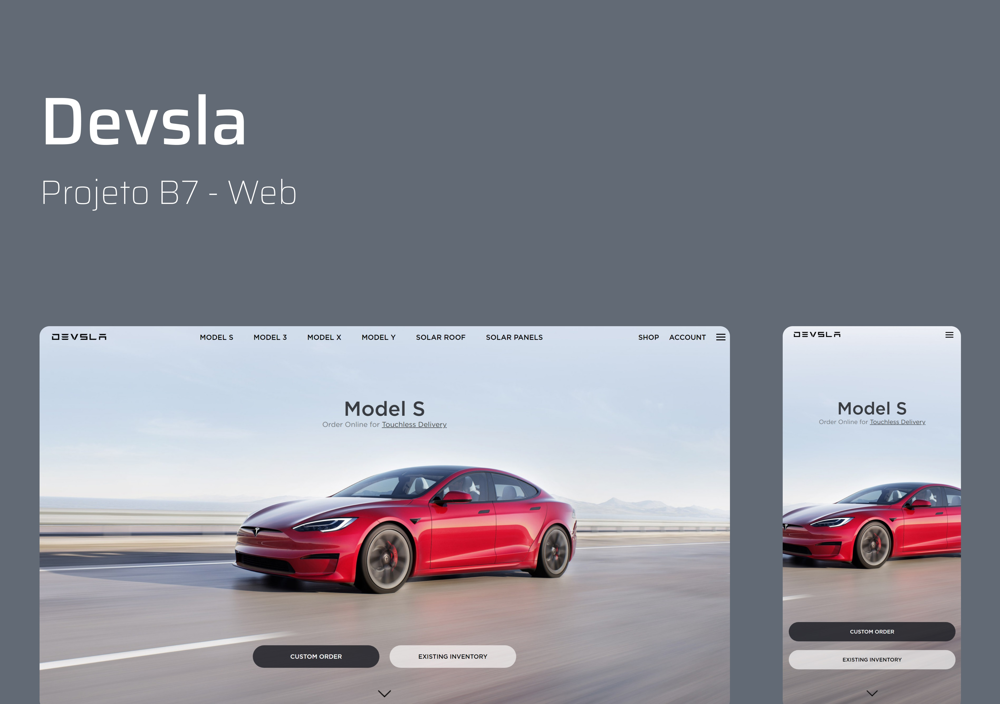

<h1 align="center">
  Devsla
</h1>

  

  
  
  

  <a href="#-projeto">Projeto</a>&nbsp;&nbsp;&nbsp;|&nbsp;&nbsp;&nbsp;
  <a href="#-tecnologias">Tecnologias</a>&nbsp;&nbsp;&nbsp;|&nbsp;&nbsp;&nbsp;
  <a href="#memo-licença">Licença</a>

 

A página está online e disponível <a href='https://brittocx.github.io/devsla/'> aqui</a>

  

## 💻 Projeto

Clone do Site da Tesla com pequenas alterações, feito utilizando apenas HTML e CSS.
Tive oportunidade de aplicar na prática o uso de Flexbox e o uso de Media Queries.
O projeto foi desenvolvido no curso da B7 Web, apenas para motivo de estudo.

## 🚀 Tecnologias

Esse projeto foi desenvolvido com as seguintes tecnologias:

- HTML
- CSS

## :memo: Licença

Esse projeto está sob a licença MIT. Veja o arquivo [LICENSE](/LICENSE.md) para mais detalhes.

---
